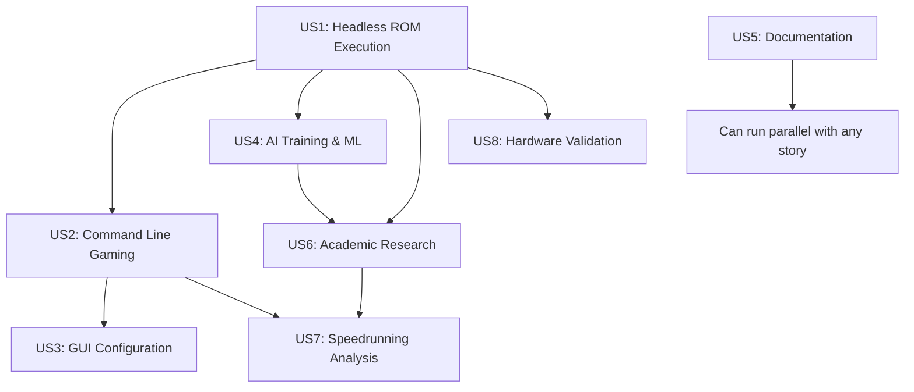

# Implementation Tasks: 8Bitten - Cycle-Accurate NES Emulator

**Feature**: 8Bitten - Cycle-Accurate NES Emulator
**Branch**: `001-cycle-accurate-emulator`
**Created**: 2025-10-26
**Updated**: 2025-10-26 (Regenerated from Design Artifacts)
**Total Estimated Tasks**: 125 tasks across 8 user stories

## Implementation Strategy

**MVP Scope**: User Story 1 (Headless ROM Execution) - Provides foundation for all other features
**Delivery Approach**: Incremental delivery by user story priority with research-grade quality standards
**Parallel Opportunities**: Core components (CPU, PPU, APU) can be developed in parallel after foundational setup
**Quality Gates**: TDD approach with comprehensive testing at each phase
**Architecture**: Component-based design with clear interfaces and dependency injection

## Dependencies & Execution Order

**Critical Path**: US1 → US2 → US3  
**Research Path**: US1 → US4 → US6 → US7  
**Validation Path**: US1 → US8

## Phase 1: Project Setup

**Goal**: Initialize project structure and foundational infrastructure

- [x] T001 Create .NET 9.0 solution file in repository root
- [x] T002 [P] Create project structure per implementation plan in src/
- [x] T003 [P] Initialize NuGet package references (MonoGame, NAudio, Avalonia, SignalR, Spectre.Console, xUnit)
- [x] T004 [P] Create global.json and Directory.Build.props for .NET 9.0 configuration
- [x] T005 [P] Setup EditorConfig and code style configuration files
- [x] T006 [P] Create initial README.md with project overview and build instructions
- [x] T007 [P] Setup GitHub Actions CI/CD pipeline configuration in .github/workflows/
- [x] T008 [P] Create initial logging configuration in src/Infrastructure/Logging/
- [x] T009 [P] Setup configuration management foundation in src/Infrastructure/Configuration/

**✅ PHASE 1 COMPLETE**: All project setup tasks completed successfully with research-grade quality standards

## Phase 2: Foundational Components

**Goal**: Core emulation infrastructure required by all user stories

- [ ] T010 Implement base emulator interfaces in src/Core/Contracts/
- [ ] T011 [P] Create CPU state model in src/Core/CPU/CPUState.cs
- [ ] T012 [P] Create PPU state model in src/Core/PPU/PPUState.cs
- [ ] T013 [P] Create APU state model in src/Core/APU/APUState.cs
- [ ] T014 [P] Create memory map interfaces in src/Core/Memory/IMemoryMap.cs
- [ ] T015 [P] Create cartridge loading interfaces in src/Core/Cartridge/ICartridge.cs
- [ ] T016 [P] Implement timing coordination system in src/Core/Timing/TimingCoordinator.cs
- [ ] T017 [P] Create ROM file format parser in src/Core/Cartridge/ROMParser.cs
- [ ] T018 [P] Implement basic mapper interface in src/Core/Cartridge/IMapper.cs
- [ ] T019 [P] Setup platform abstraction layer in src/Infrastructure/Platform/

## Phase 3: User Story 1 - Headless ROM Execution (Priority P1)

**Goal**: Enable ROM loading and execution without graphics for testing and validation  
**Independent Test**: Load test ROM via command line, verify cycle-accurate execution, validate against reference outputs

- [ ] T020 [US1] Implement 6502 CPU core in src/Core/CPU/CPU6502.cs
- [ ] T021 [US1] Implement CPU instruction set in src/Core/CPU/Instructions/
- [ ] T022 [US1] Implement PPU core (headless mode) in src/Core/PPU/PPU.cs
- [ ] T023 [US1] Implement APU core (silent mode) in src/Core/APU/APU.cs
- [ ] T024 [US1] Implement memory management system in src/Core/Memory/MemoryManager.cs
- [ ] T025 [US1] Implement NROM mapper in src/Core/Cartridge/Mappers/NROM.cs
- [ ] T026 [US1] Create main emulator orchestrator in src/Core/Emulator.cs
- [ ] T027 [US1] Implement headless execution mode in src/Emulator.Console/Headless/Program.cs
- [ ] T028 [US1] Create ROM validation and error handling in src/Core/Cartridge/ROMValidator.cs
- [ ] T029 [US1] Implement cycle-accurate timing system in src/Core/Timing/CycleTimer.cs
- [ ] T030 [US1] Create diagnostic output system in src/Infrastructure/Logging/DiagnosticLogger.cs
- [ ] T031 [US1] Add command-line argument parsing for headless mode
- [ ] T032 [US1] Implement graceful error handling and exit codes

**US1 Parallel Opportunities**: T020-T025 (core components), T028-T030 (utilities)

## Phase 4: User Story 2 - Command Line Gaming (Priority P2)

**Goal**: Add graphics and audio output with simple CLI launch  
**Independent Test**: Launch game via CLI, verify window opens, graphics/audio work, input responsive

- [ ] T033 [US2] Implement MonoGame graphics renderer in src/Interfaces/CLI/GraphicsRenderer.cs
- [ ] T034 [US2] Implement NAudio audio output in src/Interfaces/CLI/AudioRenderer.cs
- [ ] T035 [US2] Create input handling system in src/Interfaces/CLI/InputManager.cs
- [ ] T036 [US2] Implement PPU graphics output in src/Core/PPU/Renderer.cs
- [ ] T037 [US2] Implement APU audio generation in src/Core/APU/AudioGenerator.cs
- [ ] T038 [US2] Create CLI game window in src/Emulator.Console/CLI/GameWindow.cs
- [ ] T039 [US2] Implement real-time execution loop in src/Emulator.Console/CLI/GameLoop.cs
- [ ] T040 [US2] Add controller input mapping in src/Interfaces/CLI/ControllerMapper.cs
- [ ] T041 [US2] Implement window management and cleanup in src/Emulator.Console/CLI/WindowManager.cs
- [ ] T042 [US2] Add performance monitoring for 60 FPS target in src/Infrastructure/Metrics/PerformanceMonitor.cs
- [ ] T043 [US2] Create CLI argument parsing for gaming mode
- [ ] T044 [US2] Implement graceful shutdown handling

**US2 Parallel Opportunities**: T033-T035 (interface components), T036-T037 (core rendering)

## Phase 5: User Story 3 - GUI Configuration (Priority P3)

**Goal**: Avalonia UI for configuration and enhanced user experience  
**Independent Test**: Launch GUI, modify settings, verify persistence and real-time application

- [ ] T045 [US3] Create Avalonia main window in src/Interfaces/GUI/MainWindow.axaml
- [ ] T046 [US3] Implement configuration view models in src/Interfaces/GUI/ViewModels/
- [ ] T047 [US3] Create graphics settings panel in src/Interfaces/GUI/Views/GraphicsSettingsView.axaml
- [ ] T048 [US3] Create audio settings panel in src/Interfaces/GUI/Views/AudioSettingsView.axaml
- [ ] T049 [US3] Create performance settings panel in src/Interfaces/GUI/Views/PerformanceSettingsView.axaml
- [ ] T050 [US3] Implement configuration persistence in src/Infrastructure/Configuration/ConfigurationManager.cs
- [ ] T051 [US3] Create ROM browser and launcher in src/Interfaces/GUI/Views/ROMBrowserView.axaml
- [ ] T052 [US3] Implement real-time settings application without restart
- [ ] T053 [US3] Add save state management UI in src/Interfaces/GUI/Views/SaveStateView.axaml
- [ ] T054 [US3] Create GUI application entry point in src/Emulator.Console/GUI/Program.cs
- [ ] T055 [US3] Implement GUI-specific error handling and user feedback

**US3 Parallel Opportunities**: T045-T049 (UI panels), T050-T052 (configuration system)

## Phase 6: User Story 4 - AI Training & Machine Learning (Priority P4)

**Goal**: MCP interface for AI agent communication and programmatic control
**Independent Test**: Connect AI agent via MCP, control emulator programmatically, extract game state data

- [ ] T056 [US4] Implement SignalR MCP server in src/Interfaces/MCP/MCPServer.cs
- [ ] T057 [US4] Create authentication middleware in src/Interfaces/MCP/AuthenticationMiddleware.cs
- [ ] T058 [US4] Implement game state extraction in src/Interfaces/MCP/GameStateProvider.cs
- [ ] T059 [US4] Create programmatic input injection in src/Interfaces/MCP/InputController.cs
- [ ] T060 [US4] Implement automated gameplay session management in src/Interfaces/MCP/SessionManager.cs
- [ ] T061 [US4] Create save state API for training in src/Interfaces/MCP/SaveStateAPI.cs
- [ ] T062 [US4] Implement performance metrics collection for ML in src/Infrastructure/Metrics/MLMetricsCollector.cs
- [ ] T063 [US4] Create structured data export for training in src/Interfaces/MCP/DataExporter.cs
- [ ] T064 [US4] Implement multi-agent session management with proper isolation
- [ ] T065 [US4] Add MCP protocol compliance and error handling
- [ ] T066 [US4] Create AI agent SDK and documentation in docs/AI-SDK/

**US4 Parallel Opportunities**: T056-T058 (core MCP), T059-T061 (control APIs), T062-T063 (data systems)

## Phase 7: User Story 5 - Technical Documentation (Priority P5)

**Goal**: Comprehensive documentation for architecture, components, and APIs
**Independent Test**: Review documentation completeness, verify diagrams accuracy, validate API examples

- [ ] T067 [US5] Create architecture documentation in docs/Architecture/Overview.md
- [ ] T068 [US5] Document CPU implementation in docs/Components/CPU.md
- [ ] T069 [US5] Document PPU implementation in docs/Components/PPU.md
- [ ] T070 [US5] Document APU implementation in docs/Components/APU.md
- [ ] T071 [US5] Document memory system in docs/Components/Memory.md
- [ ] T072 [US5] Document mapper implementations in docs/Components/Mappers.md
- [ ] T073 [US5] Create API documentation in docs/API/
- [ ] T074 [US5] Generate Mermaid diagrams for component relationships
- [ ] T075 [US5] Create comprehensive troubleshooting guides covering ROM compatibility, performance issues, audio/video glitches, input lag diagnosis, and mapper-specific problems in docs/Troubleshooting/
- [ ] T076 [US5] Document performance vs accuracy trade-offs
- [ ] T077 [US5] Create contributor guidelines and development setup docs
- [ ] T078 [US5] Implement documentation versioning and synchronization automation in .github/workflows/docs-sync.yml

**US5 Parallel Opportunities**: T067-T072 (component docs), T073-T077 (API and guides)

## Phase 8: User Story 6 - Academic Research (Priority P6)

**Goal**: Research-grade metrics, recording, and analysis tools
**Independent Test**: Collect comprehensive metrics, export research data, verify deterministic replay

- [ ] T079 [US6] Implement comprehensive metrics collection in src/Infrastructure/Metrics/ResearchMetrics.cs
- [ ] T080 [US6] Create input recording system in src/Infrastructure/Recording/InputRecorder.cs
- [ ] T081 [US6] Implement deterministic replay in src/Infrastructure/Recording/ReplayEngine.cs
- [ ] T082 [US6] Create statistical analysis tools in src/Infrastructure/Analysis/StatisticalAnalyzer.cs
- [ ] T083 [US6] Implement multi-format data export (CSV, JSON, HDF5) in src/Interfaces/Research/DataExporter.cs
- [ ] T084 [US6] Create session recording with complete state capture in src/Infrastructure/Recording/SessionRecorder.cs
- [ ] T085 [US6] Implement research APIs in src/Interfaces/Research/ResearchAPI.cs
- [ ] T086 [US6] Create frame-by-frame analysis mode in src/Infrastructure/Analysis/FrameAnalyzer.cs
- [ ] T087 [US6] Add confidence intervals and error bounds to statistical analysis
- [ ] T088 [US6] Implement cross-platform determinism validation

**US6 Parallel Opportunities**: T079-T081 (core recording), T082-T084 (analysis tools), T085-T086 (APIs)

## Phase 9: User Story 7 - Speedrunning Analysis (Priority P7)

**Goal**: Frame-perfect timing analysis and optimization tools
**Independent Test**: Analyze speedrun, generate optimization recommendations, validate timing accuracy

- [ ] T089 [US7] Implement real-time overlay system in src/Interfaces/Analysis/OverlayManager.cs
- [ ] T090 [US7] Create input optimization analyzer in src/Infrastructure/Analysis/InputOptimizer.cs
- [ ] T091 [US7] Implement run comparison tools in src/Infrastructure/Analysis/RunComparator.cs
- [ ] T092 [US7] Create performance profiling with hotspot identification in src/Infrastructure/Analysis/PerformanceProfiler.cs
- [ ] T093 [US7] Implement timing validation against console hardware in src/Infrastructure/Analysis/TimingValidator.cs
- [ ] T094 [US7] Create speedrunning-specific metrics collection in src/Infrastructure/Metrics/SpeedrunMetrics.cs
- [ ] T095 [US7] Implement optimization recommendation engine in src/Infrastructure/Analysis/OptimizationEngine.cs
- [ ] T096 [US7] Create speedrunning analysis UI in src/Interfaces/Analysis/SpeedrunAnalysisView.axaml

**US7 Parallel Opportunities**: T089-T091 (core analysis), T092-T094 (profiling and metrics)

## Phase 10: User Story 8 - Hardware Validation (Priority P8)

**Goal**: Comprehensive accuracy validation against hardware references
**Independent Test**: Run hardware test ROMs, validate against multiple references, verify edge cases

- [ ] T097 [US8] Implement Blargg test ROM integration in tests/Compatibility/Blargg/
- [ ] T098 [US8] Create hardware reference validation framework in tests/Compatibility/HardwareValidation/
- [ ] T099 [US8] Implement additional mapper support (MMC1, MMC3, UNROM) in src/Core/Cartridge/Mappers/
- [ ] T100 [US8] Create edge case testing suite in tests/Integration/EdgeCases/
- [ ] T101 [US8] Implement timing precision validation in tests/Integration/Timing/
- [ ] T102 [US8] Create automated accuracy regression testing in tests/Compatibility/RegressionTests/
- [ ] T103 [US8] Implement hardware quirk reproduction in src/Core/
- [ ] T104 [US8] Create comprehensive ROM compatibility testing framework

**US8 Parallel Opportunities**: T097-T099 (validation frameworks), T100-T102 (testing suites)

## Phase 11: Polish & Cross-Cutting Concerns

**Goal**: Final polish, performance optimization, and production readiness

- [ ] T105 [P] Implement comprehensive error handling and logging across all components
- [ ] T106 [P] Add performance optimizations based on profiling results
- [ ] T107 [P] Create installer and distribution packages for Windows, macOS, Linux
- [ ] T108 [P] Implement telemetry and crash reporting (opt-in)
- [ ] T109 [P] Add comprehensive integration tests covering all user scenarios
- [ ] T110 [P] Create user manual and getting started guides
- [ ] T111 [P] Implement accessibility features and keyboard navigation
- [ ] T112 [P] Add internationalization support for multiple languages
- [ ] T113 [P] Create automated performance benchmarking suite
- [ ] T114 [P] Final security review and vulnerability assessment

## Phase 12: Specification Refinement Implementation

**Goal**: Implement enhanced requirements from specification refinement addressing critical ambiguities

- [ ] T115 [P] [US1] Implement enhanced power-on/reset behavior with specific register initialization in src/Core/CPU/ResetHandler.cs
- [ ] T116 [P] [US1] Add comprehensive diagnostic output system with structured JSON/CSV formats in src/Infrastructure/Logging/DiagnosticExporter.cs
- [ ] T117 [P] [US2] Implement three-tier performance mode system (Maximum/Balanced/Performance) in src/Core/Timing/PerformanceModeManager.cs
- [ ] T118 [P] [US4] Implement enhanced MCP security with JWT authentication and role-based access control in src/Interfaces/MCP/SecurityManager.cs
- [ ] T119 [P] [US6] Add structured data export schemas for CSV, JSON, HDF5, and binary formats in src/Interfaces/Research/SchemaDefinitions.cs

**US12 Parallel Opportunities**: All tasks can run in parallel as they address different components

## Phase 13: Data Model Implementation

**Goal**: Implement comprehensive data models based on design artifacts

- [ ] T120 [P] [US1] Implement CPU state model with all 6502 registers and flags in src/Core/CPU/CPUState.cs
- [ ] T121 [P] [US1] Implement PPU state model with VRAM, OAM, and rendering pipeline state in src/Core/PPU/PPUState.cs
- [ ] T122 [P] [US1] Implement APU state model with sound channels and audio buffer state in src/Core/APU/APUState.cs
- [ ] T123 [P] [US1] Implement memory map model with address space and bank switching in src/Core/Memory/MemoryMap.cs
- [ ] T124 [P] [US1] Implement ROM cartridge model with header, PRG/CHR ROM, and mapper config in src/Core/Cartridge/ROMCartridge.cs
- [ ] T125 [P] [US6] Implement session recording model with complete state capture in src/Infrastructure/Recording/SessionRecording.cs

**US13 Parallel Opportunities**: All data models can be implemented in parallel

## Parallel Execution Examples

### Phase 3 (US1) Parallel Groups:
- **Group A**: T020 (CPU), T022 (PPU), T023 (APU) - Core components
- **Group B**: T024 (Memory), T025 (NROM), T028 (Validation) - Support systems
- **Group C**: T029 (Timing), T030 (Diagnostics), T031 (CLI args) - Infrastructure

### Phase 4 (US2) Parallel Groups:
- **Group A**: T033 (Graphics), T034 (Audio), T035 (Input) - Interface components
- **Group B**: T036 (PPU Renderer), T037 (APU Audio), T042 (Performance) - Core rendering
- **Group C**: T038 (Window), T039 (Game Loop), T041 (Window Mgmt) - Application layer

### Cross-Story Parallel Opportunities:
- **Documentation (US5)** can run parallel with any implementation phase
- **Testing frameworks (US8)** can be developed alongside core components
- **Research infrastructure (US6)** can be built parallel to core emulation

## Task Summary

**Total Tasks**: 125 tasks across 13 phases
**MVP Scope**: Phase 1-3 (T001-T032) - 32 tasks for basic headless emulation
**Core Gaming**: Phase 1-4 (T001-T044) - 44 tasks for full gaming experience
**Research Platform**: Phase 1-8 (T001-T088) - 88 tasks for academic research capabilities
**Enhanced Platform**: Phase 1-12 (T001-T119) - 119 tasks including specification refinements
**Complete Platform**: All phases (T001-T125) - 125 tasks for definitive NES emulator with comprehensive data models

**Estimated Timeline**: 6-12 months depending on team size and parallel execution capability

## Design Artifacts Integration

**Phase 13 incorporates comprehensive design artifacts**:
- **Data Models**: Complete entity models from data-model.md with state management
- **Interface Contracts**: Implementation of contracts from emulator-core.cs and mcp-interface.json
- **Research Decisions**: Technology choices from research.md (MonoGame, NAudio, Avalonia)
- **Architecture Alignment**: Project structure follows plan.md specifications
- **Quality Standards**: TDD approach with comprehensive testing framework

## Specification Refinement Integration

**Phase 12 addresses critical specification refinements**:
- **Enhanced Security**: JWT-based MCP authentication with role-based access control
- **Performance Modes**: Three-tier system with quantified accuracy/speed trade-offs
- **Diagnostic Output**: Comprehensive structured logging with JSON/CSV formats
- **Data Export Schemas**: Defined schemas for all research data export formats
- **Hardware Accuracy**: Enhanced power-on/reset behavior with specific register values

These refinements resolve HIGH severity ambiguities identified in cross-artifact analysis and ensure research-grade quality standards.
